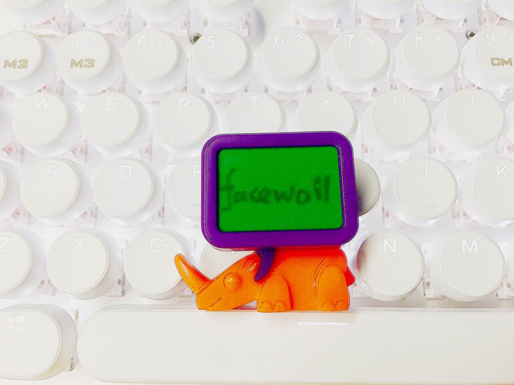

# facewall

<http://tingyinhelen.github.io/facewall>



# API

## Class FaceWall

1. constructor()
1. init(wall?: Wall | Wall[]): Promise\<void\>

## Class Thumbnail

1. constructor(thumb: string, orignal?: string)
1. url(): string
1. orignalUrl(): string
1. to(wall: Wall | null): Promise \<void\>

## Class Wall

1. constructor(thumb?: Thumbnail | Thumbnail[])
1. add(thumb: Thumbnail | Thumbnail[]): Promise\<void\>
1. del(thumb: Thumbnail | Thumbnail[]): Promise\<void\>
1. destroy():  Promise\<void\>

Example:

```js
const canvas = document.getElementById('facewall-canvas')

const facewall = new Facewall(canvas)
await facewall.init()

const wall1 = new Wall() // a Wall class instance
const wall2 = new Wall()  // should be able to accept a Thumbnail list as parameters, like: new Wall([thumb1, thumb2])

await facewall.add(wall1)     // anamition: create a wall in 3d sense dynamicly
await facewall.add(wall2)     // anamition: create a wall in 3d sense dynamicly

const thumb1 = new Thumbnail('image/6-1.jpg', 'image/bigImg6.jpeg')
const thumb2 = new Thumbnail('image/7-2.jpg', 'image/bigImg7.jpeg')

await wall1.addThumb(thumb1)  // anamition: a new face thumb appear
await wall2.addThumb(thumb2)  // anamition: a new face thumb appear

await wall1.remove(thumb1)    // anamition: a new face thumb disappear
await wall2.add(thumb1)       // anamition: a new face thumb appear

await thumb2.to(wall1)        // anamition: move thumb2 from wall2 to wall1

await wall2.destroy()         // anamition: disappear
```
